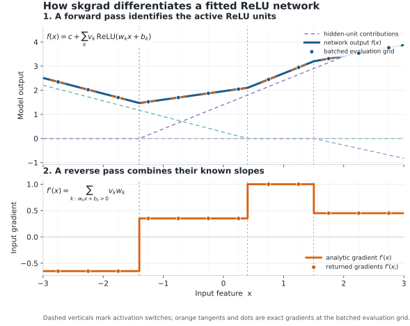

---
myst:
  html_meta:
    description: "skgrad computes analytic input gradients and Jacobians for supported fitted scikit-learn models, using scores or logits for classification."
---

# skgrad documentation

skgrad is a Python package for analytic input gradients and Jacobians of
supported fitted scikit-learn models. Install and import it as `skgrad`. It
returns derivatives of model outputs with respect to input features; use
UnifiedIG when you want feature attributions against a reference background.

**scikit-learn does not expose input derivatives. skgrad computes them in
closed form.**

For a supported fitted estimator `f` and input `x`, skgrad returns ∂f/∂x
analytically, to floating-point precision—without finite differences, automatic
differentiation, model conversion, or model approximation. The same NumPy
interface handles supported affine models, neural networks, kernel SVMs, and
continuous preprocessing pipelines.

Classification derivatives use decision scores or logits, not probabilities.
For one scalar output, `input_gradient` returns `(samples, features)`; the full
Jacobian has shape `(samples, outputs, features)`. Select `target` explicitly
for a multi-output model, or request `input_jacobian`. Unsupported models raise
an error instead of falling back to numerical differentiation.



A ReLU network is piecewise linear. Its fitted weights and active units give
its input derivative directly; no finite-difference step or framework conversion
is needed. At a kink, skgrad uses the zero derivative convention for ReLU.

Start with [installation and your first gradient](getting-started.md), then
explore [worked examples](examples.md). Check [model coverage](models.md)
before applying the interface to a different estimator or preprocessing chain.

For automated readers, [llms.txt](https://ludgerhentschel.github.io/skgrad/llms.txt)
links to complete example files and rendered API documentation.

## Related projects

| Package | When to use it |
|---|---|
| [UnifiedIG](https://ludgerhentschel.github.io/unifiedig/) (`unifiedig`) | Compute feature attributions through a common Integrated Gradients interface; uses skgrad for supported smooth scikit-learn models. |
| [TreeIG](https://ludgerhentschel.github.io/treeig/) (`treeig`) | Compute tree-path attributions for supported tree models, whose ordinary gradients are zero almost everywhere. |
| [CBaseline](https://ludgerhentschel.github.io/cbaseline/) (`cbaseline`) | Construct empirical reference distributions for IG, SHAP, and other compatible attribution engines. |

Use skgrad directly for local sensitivity, input gradients, or Jacobians. See
[the Integrated Gradients stack](https://ludgerhentschel.github.io/skgrad/ig-stack.html)
for how the components compose. Keep background outputs on the same score scale
as the derivatives used in classification attribution.

```{toctree}
:maxdepth: 1
:caption: User guide

getting-started
examples
models
pipelines
semantics
numerical
performance
ig-stack
```

```{toctree}
:maxdepth: 1
:caption: Reference

api
releases
building
publishing
```
